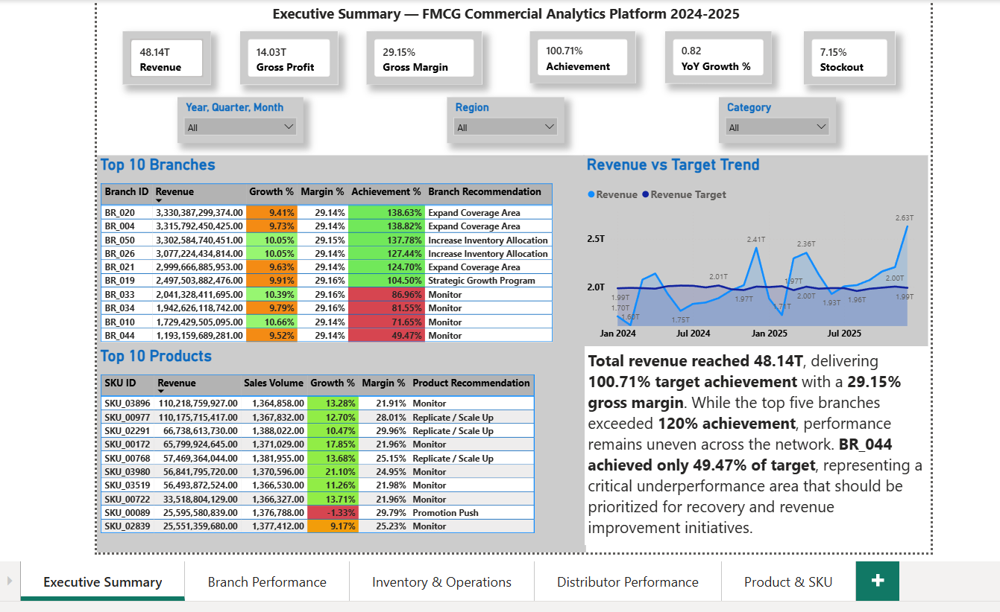
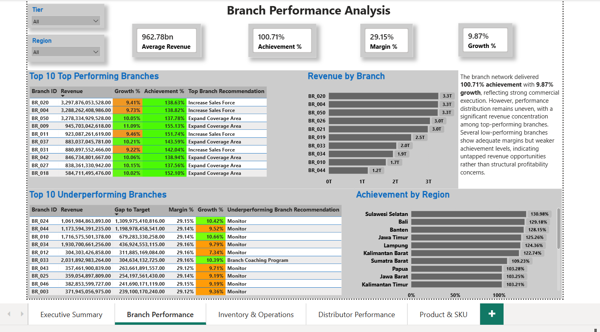
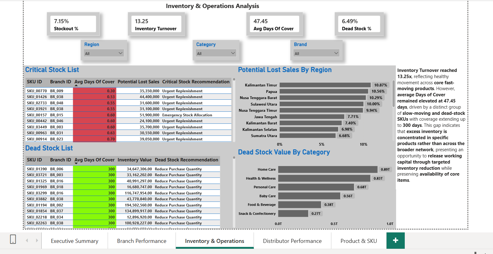
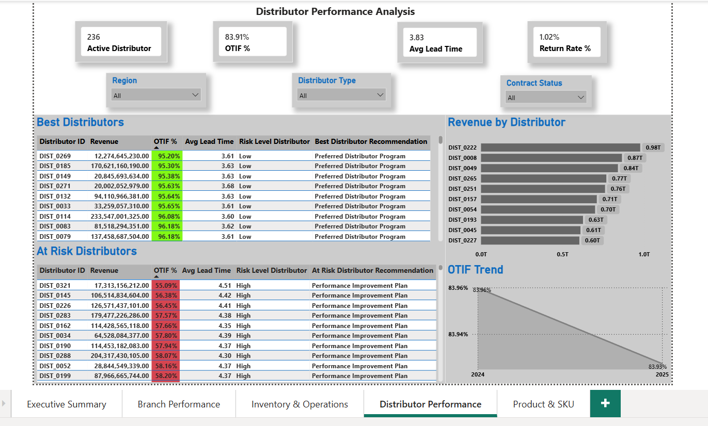
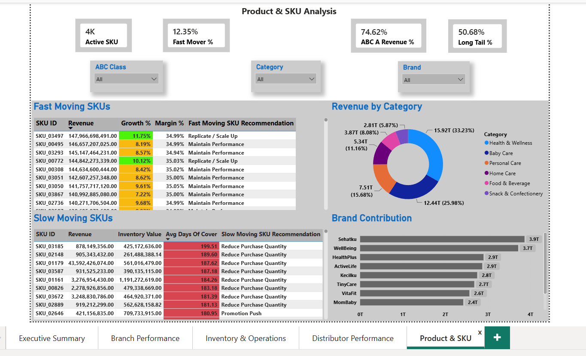
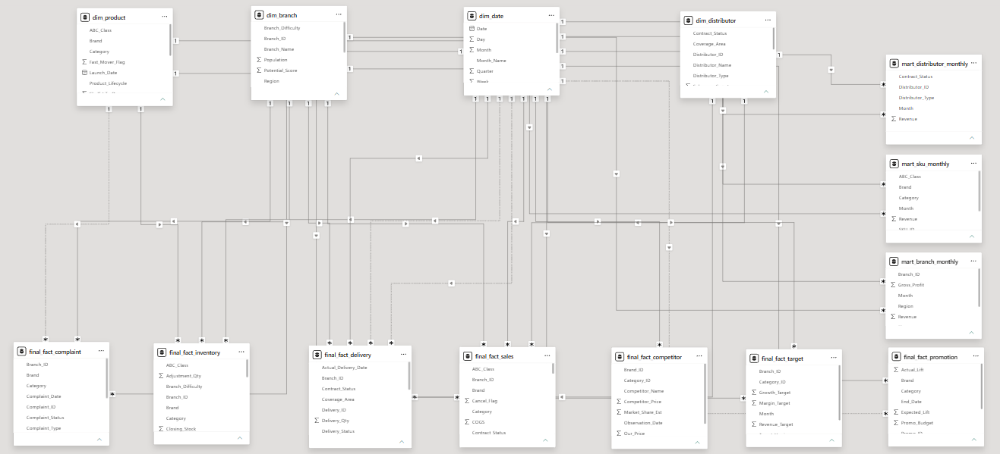

# 🚀 FMCG Enterprise Analytics Solution

<div align="center">


<p align="center">
  <b>End-to-End Analytics Pipeline & BI Dashboard untuk Sektor Fast-Moving Consumer Goods (FMCG)</b>
</p>

[📌 Key Features](#-key-features) •
[📊 Project Scale](#-project-scale) •
[💼 Business Value](#-business-value) •
[📊 Dashboard Showcase](#-dashboard-showcase) •
[🎥 Dashboard Walkthrough](#-dashboard-walkthrough) •
[🏗️ Solution Architecture](#️-solution-architecture) •
[📈 Key Business Capabilities](#-key-business-capabilities) •
[🔍 Data Quality Framework](#-data-quality-framework) •
[📂 Repository Structure](#-repository-structure) •
[🛠️ Tech Stack](#️-tech-stack) •
[🚀 Quick Start](#-quick-start) •
[👤 Author](#-author)

---

</div>

## 📖 Overview

**FMCG Enterprise Analytics** adalah proyek portofolio *data analytics* komprehensif yang dirancang untuk mensimulasikan pemrosesan data, pemodelan analitikal, hingga pembuatan dasbor keputusan eksekutif pada industri FMCG skala *enterprise*. 

Proyek ini mencakup seluruh rantai nilai analisis data: dari **pembersihan & validasi data mentah berbasis SQL (DuckDB)**, **pembangunan Data Mart & KPI Modeling**, hingga **visualisasi interaktif Power BI** untuk memantau kinerja penjualan, cabang, distributor, inventaris, dan produk.

---

## 📌 Key Features

- 🧹 **Robust Data Pipeline & Cleaning:** Proses ETL/ELT terstruktur menggunakan DuckDB SQL untuk pembersihan, validasi, dan penanganan anomali data.
- 📐 **Enterprise Data Mart & KPI Framework:** Pemodelan data bisnis FMCG dengan indikator kinerja utama (*Sales, Growth, Inventory Turnover, Distributor Performance*).
- 📊 **5-Tab Interactive Power BI Dashboard:**
  1. **Executive Summary:** Overview performa bisnis level C-suite.
  2. **Branch Performance:** Analisis mendalam kontribusi dan efisiensi antar cabang.
  3. **Distributor Performance:** Evaluasi keandalan dan sell-out distributor.
  4. **Inventory & Operations:** Pemantauan stok, turnover rate, dan keandalan suplai.
  5. **Product & SKU Analysis:** Klasifikasi Pareto/ABC, tren kategori, dan performa produk.
- 📑 **Comprehensive Enterprise Documentation:** Dokumentasi 38 modul terstruktur dari *problem statement*, *data dictionary*, hingga *business action plan*.

---

## 📊 Project Scale

This project was designed to simulate an enterprise-scale FMCG analytics environment.

### Dataset Scale
- **20,000,000+** Sales Transactions
- **50** Branches
- **350** Distributors
- **4,000+** SKUs
- **2 Years** Historical Data
- **7** Fact Tables
- **4** Dimension Tables

### Analytics Scale
- **40+** Custom DAX Measures
- **14** Business Data Marts
- **80+** Business KPIs & Metrics
- **5** Executive Dashboard Pages
- **38** End-to-End Documentation Modules

---

## 💼 Business Value

This solution was developed as a centralized analytics platform that supports business decision-making across multiple departments.

### Stakeholders Supported
- CEO
- Commercial Director
- Supply Chain Director
- Regional Manager
- Sales Manager
- Category Manager
- Inventory Planner
- Distributor Manager
- Business Analyst

### Business Use Cases
- Revenue Performance Monitoring
- Branch Performance Optimization
- Distributor Performance Evaluation
- Inventory Risk Management
- Dead Stock Monitoring
- Critical Stock Monitoring
- Product Portfolio Analysis
- Promotion Performance Analysis
- KPI Monitoring & Executive Reporting

The dashboard acts as a **Single Source of Truth (SSOT)** by providing standardized KPIs, business rules, and performance measurements across the organization.

---

## 📊 Dashboard Showcase

Berikut adalah tampilan dari dasbor interaktif Power BI yang telah dikembangkan:

<div align="center">

### 1. Executive Summary


### 2. Branch Performance


### 3. Distributor Performance


### 4. Inventory & Operations


### 5. Product & SKU Analysis


### 5. Product & SKU Analysis


</div>

---

## 🏗️ Solution Architecture

```text
Raw Data Layer
        ↓
Data Collection
        ↓
Data Profiling
        ↓
Data Cleaning
        ↓
Data Validation
        ↓
Data Transformation
        ↓
Data Modeling
        ↓
Business KPI Design
        ↓
Data Mart Development
        ↓
Power Query Refresh
        ↓
Power BI Dashboard
        ↓
Insights & Recommendations
        ↓
Business Action Plan
```

---

## 📈 Key Business Capabilities

### Commercial Analytics
- Revenue Analysis
- Growth Analysis
- Profitability Analysis
- Achievement Analysis

### Branch Analytics
- Top Performing Branches
- Underperforming Branches
- Branch Contribution Analysis

### Distributor Analytics
- Best Distributor Analysis
- At-Risk Distributor Analysis
- OTIF Monitoring
- Lead Time Analysis

### Inventory Analytics
- Inventory Turnover Analysis
- Days of Cover (DOC)
- Critical Stock Monitoring
- Dead Stock Monitoring

### Product Analytics
- Product Performance Analysis
- ABC Classification
- XYZ Classification
- Fast Moving SKU Analysis
- Slow Moving SKU Analysis

### Promotion Analytics
- Promotion ROI
- Sales Uplift Analysis
- Promotion Effectiveness Analysis

---

## 🔍 Data Quality Framework

The project includes a dedicated Data Quality layer to ensure business reliability.

### Validation Coverage
- Duplicate Detection
- Missing Value Handling
- Invalid Date Detection
- Orphan Record Detection
- Revenue Validation
- Margin Validation
- Relationship Validation
- KPI Reconciliation

### Quality Assurance
All dashboard KPIs were validated against SQL outputs before publication:

```text
SQL Result  =  Power BI Result
```

---

## 📚 Documentation Coverage

The project includes 38 structured documentation modules covering:

### Business Foundation
- Business Scenario
- Business Problem
- Business Objectives
- Stakeholder Analysis

### Data Understanding
- Data Collection
- Data Profiling
- Data Cleaning
- Data Validation

### Analytics Development
- KPI Design
- Business Rules
- Data Modeling
- Data Transformation
- Data Mart Development

### Reporting Layer
- Dashboard Development
- Dashboard Validation
- Insights & Recommendations
- Business Action Plan

### Governance
- Version Control
- Publishing
- Lessons Learned
- Future Improvements

---

## 🎯 Project Outcome

This project demonstrates an end-to-end analytics workflow covering:
- Data Cleaning
- Data Validation
- KPI Development
- Business Rule Design
- Data Mart Development
- Dashboard Engineering
- Business Analysis
- Executive Reporting

within an enterprise-scale FMCG business environment. The primary objective is not only to build dashboards, but also to transform raw transactional data into actionable business insights and decision-support tools.

---

## 📂 Repository Structure

Struktur direktori repository ini dirancang rapi dan modular sesuai standar enterprise:

```bash
.
├── README.md                           # Master Documentation & Portfolio Overview
├── screenshots/                        # High-Resolution Dashboard Screenshots
│   ├── 01_Executive_Summary.png
│   ├── 02_Branch_Performance.png
│   ├── 03_Distributor_Performance.png
│   ├── 04_Inventory_and_Operations.png
│   └── 05_Product_and_SKU.png
│
├── sql/                                # Data Pipeline & Analytics SQL Scripts
│   ├── step08_data_collection.sql
│   ├── step09_data_profiling.sql
│   ├── step10_dataset_overview.sql
│   ├── step11_data_cleaning.sql
│   └── step12_data_validation.sql
│
└── docs/                               # End-to-End Project Documentation
    ├── 01_PROJECT_FOUNDATION/          # Business Context & Core Objectives
    │   ├── 01_Project_Overview.md
    │   ├── 02_Business_Scenario.md
    │   ├── 03_Business_Problem.md
    │   ├── 04_Business_Objectives.md
    │   ├── 05_Business_Understanding.md
    │   ├── 06_Stakeholder_Analysis.md
    │   └── 07_Key_Business_Questions.md
    │
    ├── 02_DATA_UNDERSTANDING/          # Data Collection, Profiling & Validation
    │   ├── 08_Data_Collection.md
    │   ├── 09_Data_Profiling.md
    │   ├── 10_Dataset_Overview.md
    │   ├── 11_Data_Cleaning.md
    │   └── 12_Data_Validation.md
    │
    ├── 03_BUSINESS_FRAMEWORK/           # KPI Architecture & Data Modeling
    │   ├── 13_KPI_Design.md
    │   ├── 14_Business_Rules.md
    │   ├── 15_Project_Architecture.md
    │   └── 16_Data_Dictionary.md
    │
    ├── 04_ANALYTICS_PIPELINE/          # EDA, Feature Engineering & Data Marts
    │   ├── 17_Data_Modeling.md
    │   ├── 18_Data_Transformation.md
    │   ├── 19_Exploratory_Data_Analysis_(EDA).md
    │   ├── 20_Sales_Performance_Analysis.md
    │   ├── 21_Inventory_Analysis.md
    │   ├── 22_Branch_Performance_Analysis.md
    │   ├── 23_Distributor_Performance_Analysis.md
    │   ├── 24_Product_Performance_Analysis.md
    │   ├── 25_Promotion_Analysis.md
    │   ├── 26_Operational_KPI_Calculation.md
    │   ├── 27_Analytical_Dataset.md
    │   └── 28_Data_Mart_Development.md
    │
    ├── 05_REPORTING_and_AUTOMATION/    # Power BI Refresh, Insights & Action Plan
    │   ├── 29_Power_Query_Data_Refresh.md
    │   ├── 30_Dashboard_Development.md
    │   ├── 31_Dashboard_Validation.md
    │   ├── 32_Insight_and_Recommendation.md
    │   └── 33_Business_Action_Plan.md
    │
    └── 06_DOCUMENTATION/               # Project Wrap-Up, Governance & Lessons
        ├── 34_Project_Documentation.md
        ├── 35_Version_Control.md
        ├── 36_Publishing.md
        ├── 37_Lesson_learned.md
        └── 38_Future_Improvement.md
```

---

## 🛠️ Tech Stack & Tools

- **Database Engine & SQL:** DuckDB (High-performance OLAP SQL engine)
- **Business Intelligence & Reporting:** Microsoft Power BI / Power Query
- **Data Modeling:** Star Schema / Snowflake Schema
- **Documentation & Version Control:** Markdown, Git & GitHub
---
## 🎯 Analytics Mindset

This project was built with a business-first approach.

The primary focus is not only building dashboards or writing SQL queries, but translating raw transactional data into measurable business performance indicators, actionable insights, and decision-support recommendations.

Every KPI, metric, and dashboard visualization was designed based on business rules and validated through SQL before being published in Power BI.
---

## 👤 Author

**Ahmad Farid**
- 📧 **Email:** [ahmad.fariden@gmail.com](mailto:ahmad.fariden@gmail.com)
- 💼 **LinkedIn:** [linkedin.com/in/ahmadfariden](https://linkedin.com/in/ahmadfariden)
- 🐙 **GitHub:** [github.com/ahmadfariden](https://github.com/ahmadfariden)

---

<div align="center">

*Project ini dibangun sebagai portofolio data analytics — mencakup pipeline lengkap dari data cleaning, analisis berbasis SQL menggunakan DuckDB, hingga dashboard interaktif di Power BI.*

</div>
